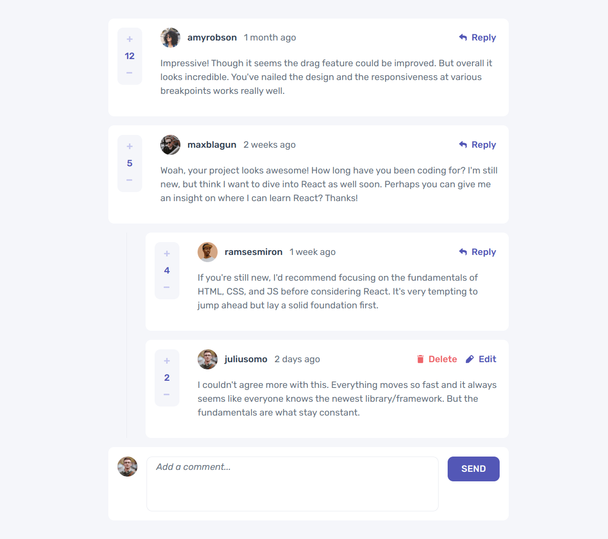

# [Frontend Mentor - Interactive comment section](https://www.frontendmentor.io/challenges/interactive-comments-section-iG1RugEG9)



# Running locally

1. clone repository

```bash
    git clone git@github.com:Raphico/interactive-comment-section.git
```

2. install dependencies

```bash
  pnpm install
```

3. start development environment

```bash
  pnpm run dev
```
